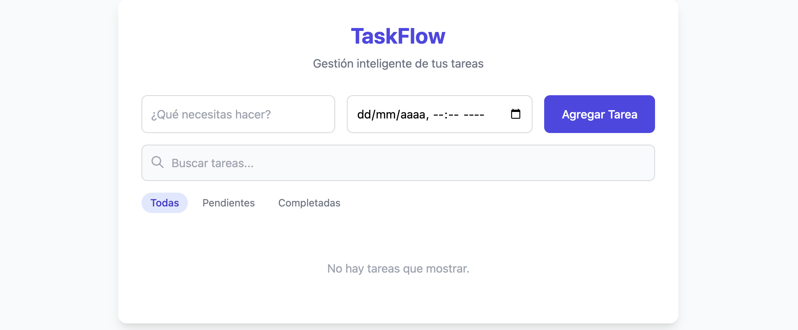
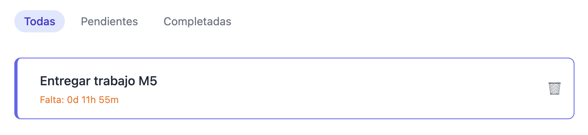

# Proyecto Módulo 5 – TaskFlow (Gestor de Tareas)

## 📖 Descripción
Este proyecto corresponde a la evaluación del **Módulo 5** del curso.  
La aplicación permite gestionar tareas de manera dinámica desde la **interfaz web**, utilizando programación orientada a objetos, asincronía y consumo de API.

## 🚀 Uso
1. Abre el archivo `index.html` en tu navegador.
2. Completa el formulario para agregar una nueva tarea.
3. Utiliza la búsqueda y los filtros para gestionar tus tareas.
4. Observa las notificaciones (toasts) y la cuenta regresiva en tareas con fecha límite.

## 🛠️ Funcionalidades
- **POO**: Clases `Tarea` y `GestorTareas` con métodos para administrar tareas.
- **ES6**: Uso de `let/const`, arrow functions, destructuring y template literals.
- **Formulario dinámico**: Agregar tareas con descripción y fecha límite.
- **Búsqueda en vivo**: Filtrar tareas por texto.
- **Filtros**: Mostrar todas, pendientes o completadas.
- **Renderizado dinámico**: Lista de tareas con estilos y estados visuales.
- **Asincronía**: Temporizadores de cuenta regresiva y simulación de carga.
- **Toasts**: Notificaciones visuales flotantes para acciones.
- **API + LocalStorage**: Carga inicial desde API y persistencia en almacenamiento local.

## 🎨 Estilos
La aplicación utiliza **TailwindCSS** para los estilos principales y un archivo `styles.css` para animaciones personalizadas:
- Animaciones de entrada y salida en toasts.
- Hover suave en botones de filtro.
- Animación sutil en items de tarea.

## 🌐 Repositorio
El proyecto está publicado en GitHub:  
👉 [Ver repositorio](https://github.com/gdiazcontreras/evaluacion-m5)

## 🚀 Deployment
El proyecto está desplegado en GitHub Pages:  
👉 [Ver aplicación](https://gdiazcontreras.github.io/evaluacion-m5)

## 📸 Capturas
- Página principal con formulario y lista vacía.  

- Ejemplo de tarea agregada con fecha límite.

## 👩‍💻 Autora
Proyecto realizado por **Gabriela Díaz Contreras**.

## 🤖 Apoyo con IA
Durante el desarrollo de este proyecto utilicé herramientas de Inteligencia Artificial (Copilot y Gemini) como apoyo para:
- Revisar errores de lógica en el código.
- Ordenar y estructurar mejor las funciones y archivos.
- Revisar el proyecto siguiendo los parámetros entregados en la consigna.
- Crear y dar forma al archivo README.md.

El trabajo final y las decisiones de implementación fueron realizadas por mí, utilizando la IA como guía y apoyo en el proceso.